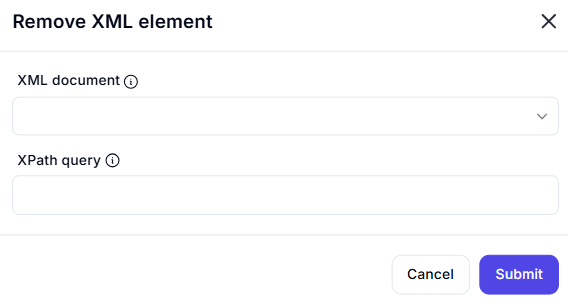

# Remove XML Element

## Description

The **Remove XML Element** action allows deleting an element from an XML document using an XPath query.



## Fields and Options  

### **1. XML Document** *(Required)* 🛈  

- Select the XML document variable from which the element should be removed.

### **2. XPath Query** *(Required)* 🛈  

- Provide an **XPath query** to locate the XML element to be deleted.
- Example:  

  ```xpath
  /bookstore/book[@category='fiction']

This selects and removes <book> elements where the category attribute is "fiction".

## Use Cases

- Removing obsolete or unnecessary elements from an XML structure.
- Cleaning up configuration files by eliminating unwanted nodes.
- Automating XML data management in workflows.

## Important Notes

- Ensure the XPath query correctly identifies the element to be deleted.
- If the query matches multiple elements, all matching elements will be removed.
- Removing an element will also remove all its child nodes.

## Summary

The Remove XML Element action simplifies XML manipulation by allowing precise deletion of elements using XPath, making it useful for automation workflows involving XML data processing.