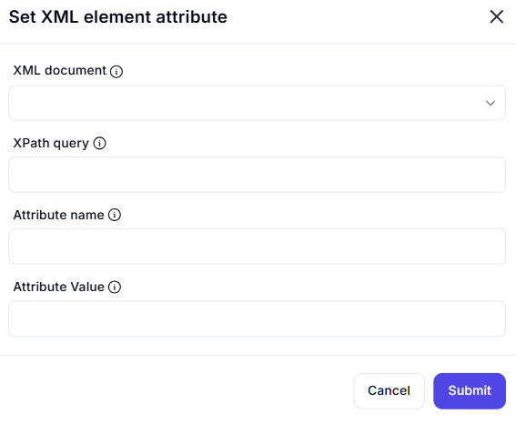

# Set XML Element Attribute

## Description

The **Set XML Element Attribute** action allows modifying an attribute value within an XML document using an XPath query.



## Fields and Options  

### **1. XML Document** *(Required)* 🛈  

- Select the XML document variable where the attribute should be set.

### **2. XPath Query** *(Required)* 🛈  

- Provide an **XPath query** to locate the XML element where the attribute needs to be set.
- Example:  

  ```xpath
  /bookstore/book[@category='fiction']
  ```

This selects <book> elements where the category attribute is "fiction".

### **3. Attribute Name (Required) 🛈

The name of the attribute that should be set or modified.

Example:

If the XML contains <book title="XML Guide">, specifying title will modify its value.

### **4. Attribute Value (Required) 🛈

The new value to assign to the specified attribute.

Example:

Setting Attribute Name as title and Attribute Value as "Advanced XML" will modify:

```xml
<book title="Advanced XML">
```

## Use Cases

Updating metadata in XML documents.
Modifying configuration settings in XML files.
Automating structured data updates.
Important Notes
Ensure the XPath query correctly identifies the target element.
If the attribute does not exist, it will be created.
If the element does not exist, the action may fail.

## Summary

The Set XML Element Attribute action enables precise modification of XML attributes using XPath, making it useful for automation workflows involving XML data manipulation.
