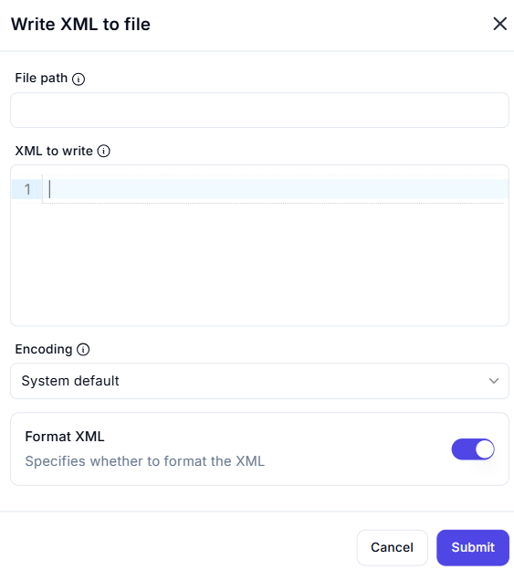

# Write XML to File

## Description

The **Write XML to File** action saves an XML document to a specified file path, allowing automation workflows to generate structured XML files.

## Fields and Options  

### **1. File Path** *(Required)* 🛈

- The absolute or relative path where the XML file will be saved.

### **2. XML to Write** *(Required)* 🛈

- The XML content to be written to the file.
- Can be a manually entered XML structure or an XML variable.

### **3. Encoding** *(Optional)* 🛈

- Defines the character encoding for the output file.  
- Default: **System Default**  
- Other options may include UTF-8, ASCII, etc.

### **4. Format XML** *(Optional, Default: Enabled)* 🛈

- If enabled, the XML is formatted for readability with proper indentation.
- If disabled, the XML is written as a single-line string.

## Use Cases

- Saving dynamically generated XML data to a file.
- Creating configuration or structured data files in XML format.
- Storing automation workflow outputs in XML for future processing.

## Important Notes

- Ensure the provided file path is valid and has write permissions.
- If the file already exists, this action may overwrite it without warning.
- Proper XML formatting is crucial to avoid errors in subsequent processing.

## Summary

The **Write XML to File** action facilitates the creation and storage of structured XML data, enabling efficient automation workflows that interact with XML files.
