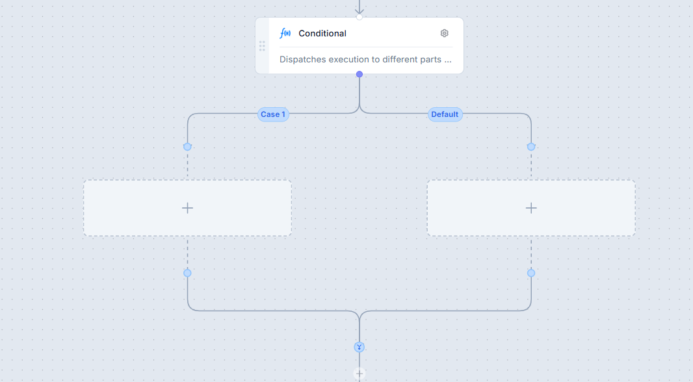
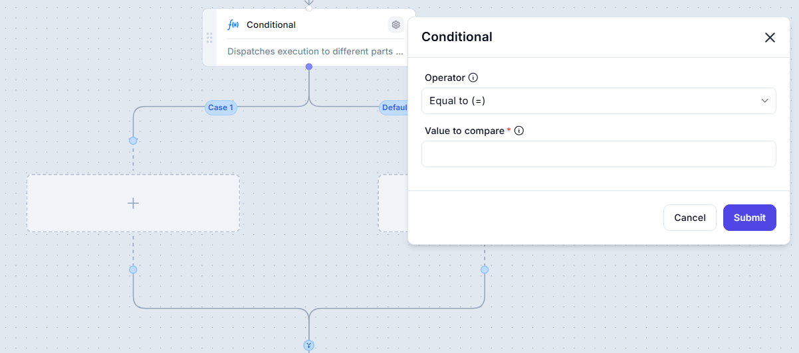

# **Conditional Node**

The **Conditional** node is a key decision-making component in workflows, allowing execution to branch based on predefined conditions. It enables dynamic control flow by evaluating variable values, user inputs, or logical expressions.

---

## **Functionality**

- Evaluates a condition and directs execution into separate branches.
- Includes multiple paths, with at least one **default** fallback path.

### **Branches**

- **Case 1**: Executes if the specified condition is met.
- **Default**: Executes when none of the predefined conditions apply.

---

## **Configuring a Condition**

To define a condition, you must choose an operator and a value for comparison.

### **List of Operators and Their Explanations**

Operators facilitate comparisons and logical checks in workflows. Below is a concise explanation of each type.

---

### **1. Equality Operators**

- **Equal to (=)** → Validates if two values are identical.  
  _Example:_ `5 = 5` → ✅ True  
- **Not equal to (<> or !=)** → Checks if two values differ.  
  _Example:_ `5 <> 3` → ✅ True  

*Use Case:* Ensure a user's role is "Admin" (`role = "Admin"`).

---

### **2. Comparison Operators**

- **Greater than (>)** → Confirms if the left value exceeds the right value.  
  _Example:_ `10 > 5` → ✅ True  
- **Greater than or equal to (>=)** → Validates if the left value is greater or equal.  
  _Example:_ `5 >= 5` → ✅ True  
- **Less than (<)** → Checks if the left value is smaller.  
  _Example:_ `3 < 10` → ✅ True  
- **Less than or equal to (<=)** → Ensures the left value is smaller or equal.  
  _Example:_ `3 <= 3` → ✅ True  

*Use Case:* Apply a discount if an order exceeds `$100` (`orderTotal > 100`).

---

### **3. String Operators**

- **Contains** → Determines if a string includes a specified substring.  
  _Example:_ `"hello world" contains "world"` → ✅ True  
- **Does not contain** → Ensures a string does NOT include a substring.  
  _Example:_ `"hello world" does not contain "hi"` → ✅ True  
- **Starts with** → Confirms if a string begins with a particular sequence.  
  _Example:_ `"apple" starts with "a"` → ✅ True  
- **Does not start with** → Ensures a string does NOT start with a specific sequence.  
  _Example:_ `"apple" does not start with "b"` → ✅ True  
- **Ends with** → Checks if a string concludes with a particular value.  
  _Example:_ `"apple" ends with "e"` → ✅ True  
- **Does not end with** → Validates that a string does NOT end with a certain value.  
  _Example:_ `"apple" does not end with "x"` → ✅ True  

*Use Case:* Verify if an email ends with `@gmail.com` (`email ends with "@gmail.com"`).

---

### **4. Null/Empty Operators**

- **Is empty** → Checks if a field contains no value.  
  _Example:_ `"" is empty` → ✅ True  
- **Is not empty** → Ensures that a field has a value.  
  _Example:_ `"Hello" is not empty` → ✅ True  

*Use Case:* Confirm if a user has entered a phone number (`phoneNumber is not empty`).

---

## **Usage Scenarios**

- Essential for decision-making in workflows.
- Enables dynamic automation with multiple execution paths.
- Commonly used in form validation, user input handling, and logic-based automation.

### **Example Scenario**

- If `orderStatus` is `"Pending"`, the **Case 1** branch executes.
- Otherwise, the **Default** branch executes.

---

## **Summary**

Operators play a crucial role in workflow decision-making. They allow you to:

- Compare values (numbers, text, booleans).  
- Implement rule-based automation dynamically.  
- Handle conditions and lists efficiently.  
