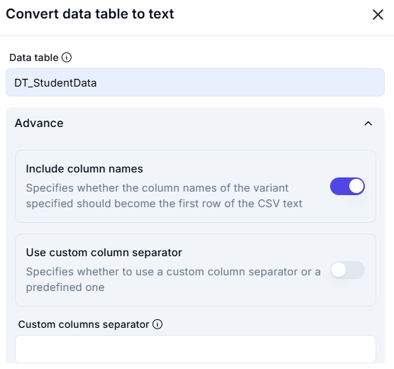
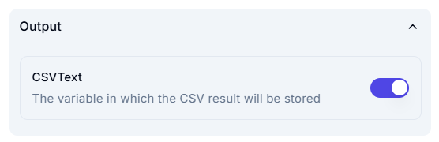

# **Convert Data Table to Text**  

## **Overview**  

This operation converts the data table **DT_StudentData** into a text-based format, such as CSV.  

## **Input Parameters**  

| Parameter                 | Value             | Description |
|---------------------------|------------------|-------------|
| **Data Table**            | `DT_StudentData`  | The data table to be converted into text. |
| **Include Column Names**  | `Enabled`         | Ensures the first row of the output contains column names. |
| **Use Custom Separator**  | `Disabled`        | Uses a predefined separator instead of a custom one. |
| **Custom Column Separator** | `N/A`          | Not applicable since custom separators are disabled. |

## **Output**  

| Parameter  | Description |
|------------|-------------|
| **CSVText** | The variable where the converted CSV result will be stored. |

## **Effect**  

- Converts **DT_StudentData** into a **text-based** format.  
- Includes **column names** in the first row.  
- Uses the **default column separator** for formatting.  
- Stores the result in the **CSVText** variable for further use.  
