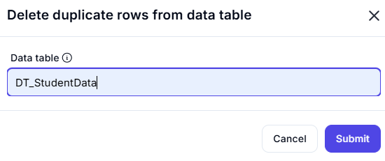

# **Delete Duplicate Rows from Data Table**

This configuration removes duplicate rows from a specified data table.

---

## **Configuration Details**

### **Data Table:** `DT_StudentData`

- The table from which duplicate rows will be removed.

---

## **Example Use Case**

### **Input Data Table(`DT_StudentData`)**

| Index | StudentID | Name    | Score |
|-------|----------|---------|------|
| 1     | S001     | Alice   | 85   |
| 2     | S002     | Bob     | 78   |
| 3     | S003     | Charlie | 92   |
| 4     | S001     | Alice   | 85   |
| 5     | S002     | Bob     | 78   |

---

### **Action Performed**

- **Duplicate rows** (rows that are exactly the same as others) are **removed**, keeping only the first occurrence.

---

### **Output After Deletion**

| Index | StudentID | Name    | Score |
|-------|----------|---------|------|
| 1     | S001     | Alice   | 85   |
| 2     | S002     | Bob     | 78   |
| 3     | S003     | Charlie | 92   |

---

## **Summary**

- **Before:** Table contained duplicate entries for `S001 - Alice` and `S002 - Bob`.
- **After:** Only the first occurrence of each unique row remains.
- **Use Case:** Helps in ensuring data integrity by eliminating duplicate records.
