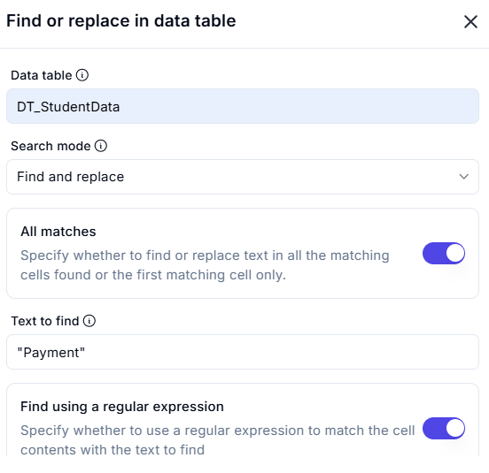
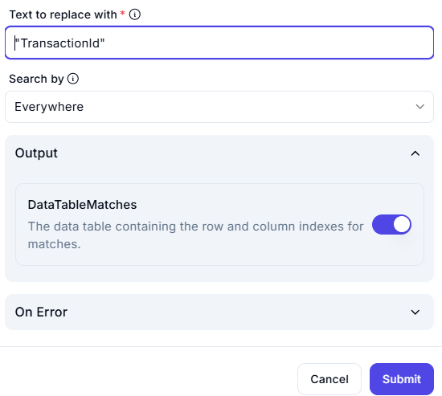

# **Find or Replace in Data Table**

This configuration allows searching for specific text within a data table and replacing it if needed.

---

## **Configuration Details**

### **Data Table:** `DT_StudentData`

- The table where the search and replace operation will be performed.

### **Search Mode:** `Find and Replace`

- The mode is set to locate and substitute occurrences of a specific text.

### **All Matches:** Enabled ✅

- All instances of the text found in the table will be replaced, not just the first occurrence.

### **Text to Find:** `"Payment"`

- The exact text that will be searched for in the data table.

### **Find Using a Regular Expression:** Enabled ✅

- The text search supports regular expressions, allowing for pattern-based matching.

### **Text to Replace With:** `"TransactionId"`

- Any found occurrence of `"Payment"` will be replaced with `"TransactionId"`.

### **Search By:** `Everywhere`

- The search will be performed across all columns and rows of the data table.

### **Output:**

- **DataTableMatches** (Enabled ✅)
- Stores the row and column indexes where matches are found.

---

## **Example Use Case**

### **Input Data Table (`DT_StudentData`):**

| Index | TransactionID | Description       | Amount |
|-------|--------------|------------------|--------|
| 1     | TXN001       | Payment Pending  | 100    |
| 2     | TXN002       | Payment Received | 200    |
| 3     | TXN003       | Refund Issued    | 150    |

---

### **Action Performed**

- **Search for:** `"Payment"`
- **Replace with:** `"Transaction"`

---

### **Output After Replacement**

| Index | TransactionID | Description            | Amount |
|-------|--------------|-----------------------|--------|
| 1     | TXN001       | Transaction Pending   | 100    |
| 2     | TXN002       | Transaction Received  | 200    |
| 3     | TXN003       | Refund Issued         | 150    |

---

## **Summary**

- **Before:** `"Payment Pending"`, `"Payment Received"`
- **After:** `"Transaction Pending"`, `"Transaction Received"`
- **Use Case:** Useful for bulk updates, text corrections, and standardizing terminology in a dataset.
