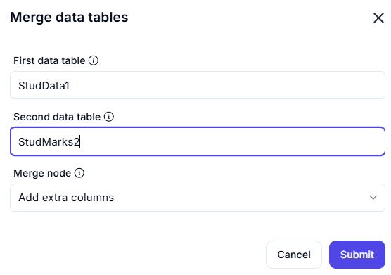

# **Merging Data Tables**  

## **Overview**  

This process merges two data tables, **StudData1** and **StudMarks2**, by incorporating additional columns.  

## **Input Parameters**

| Parameter            | Value              | Description                                      |
|----------------------|-------------------|--------------------------------------------------|
| **Primary Table**    | `StudData1`        | The main dataset to which new data will be added. |
| **Secondary Table**  | `StudMarks2`       | The dataset containing additional columns to merge. |
| **Merge Mode**       | `Add extra columns` | Integrates new columns from `StudMarks2` into `StudData1`. |

## **Output**

| Parameter           | Description                                           |
|--------------------|-------------------------------------------------------|
| **Merged Table**  | The resulting table includes all rows from `StudData1` along with newly added columns from `StudMarks2`. |

## **Effects & Handling Options**  

- **Combines both tables** while maintaining all existing data.  
- **Adds extra columns** from `StudMarks2` into `StudData1` rather than appending rows.  
- Different handling options for extra columns:  
  - **Ignore extra columns** → Leaves out any additional columns that don’t match.  
  - **Error on extra columns** → Triggers an error if new columns exist in `StudMarks2`.  
- Ensures that **no data loss occurs** during merging.  

---

## **Example Scenario**  

### **Before Merging:**  

#### **StudData1 (Primary Table)**

| StudentID | Name    | Age |
|-----------|--------|-----|
| 101       | Alice  | 20  |
| 102       | Bob    | 21  |

#### **StudMarks2 (Secondary Table)**

| StudentID | Marks  | Grade |
|-----------|--------|-------|
| 101       | 85     | A     |
| 102       | 78     | B     |

---

### **After Merging (Add Extra Columns Mode)**  

#### **Merged Table**

| StudentID | Name    | Age | Marks | Grade |
|-----------|--------|-----|-------|-------|
| 101       | Alice  | 20  | 85    | A     |
| 102       | Bob    | 21  | 78    | B     |
