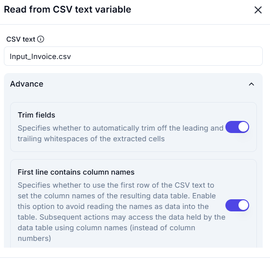
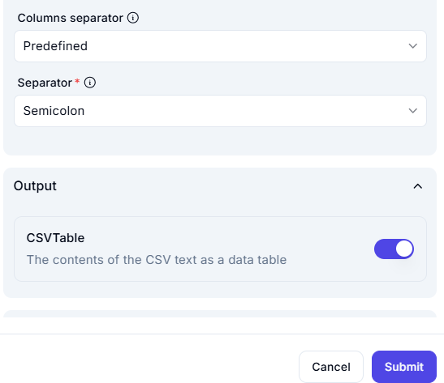

# **Read from CSV Text Variable**  

## **Overview**  

This operation reads data from a CSV file (`Input_Invoice.csv`) and converts it into a structured data table.  

## **Input Parameters**  

| Parameter       | Value               | Description |
|----------------|---------------------|-------------|
| **CSV Text**   | `Input_Invoice.csv`  | The CSV file to be read. |

| Parameter            | Value         | Description |
|----------------------|--------------|-------------|
| **Columns Separator** | `Predefined`  | Uses a predefined column separator. |

| **Separator**        | `Semicolon`   | Specifies that columns are separated by semicolons (`;`). |

## **Output**  

| Parameter  | Description |
|------------|-------------|

| **CSVTable** | Stores the extracted CSV data as a structured data table. |

## **Advanced Options**  

| Option                          | Status | Description |
|---------------------------------|--------|-------------|

| **Trim Fields**                 | ✅ Enabled | Automatically removes leading and trailing whitespaces from extracted cells. |

| **First Line Contains Column Names** | ✅ Enabled | Uses the first row as column headers instead of treating it as data. |

## **Effect**  

- Reads CSV content and structures it into a **data table**.  
- Uses **semicolon (`;`)** as the column separator.  
- Ensures proper formatting of tabular data for further processing.  
- Reads and structures data from `Input_Invoice.csv`.  
- Ensures that **column headers** are correctly assigned.  
- **Whitespace trimming** prevents unintended formatting issues.
