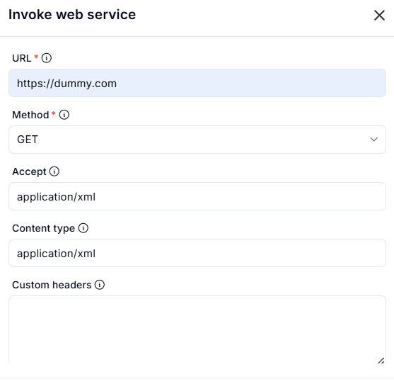
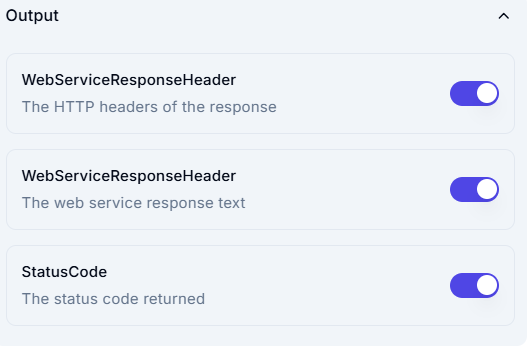

# **Invoke Web Service Node in Workflow Automation**

The **Invoke Web Service** node is a key component in workflow automation that allows seamless interaction with external web services via HTTP requests. It enables workflows to fetch, send, or process data from APIs or remote servers.

---




## **🔹 Functionality**
The **Invoke Web Service** node is used to:
- Connect with external APIs and web services.
- Perform various HTTP request methods (`GET`, `POST`, etc.).
- Handle different data formats such as `JSON` and `XML`.

---

## **🔹 Key Configuration Options**
When setting up this node, the following parameters must be defined:

### **1️⃣ URL (Required)**
   - Specifies the web service endpoint to interact with.
   - Example: `https://dummy.com`

### **2️⃣ Method (Required)**
   - Defines the HTTP request type.
   - Options include:
     - **GET** → Retrieves data from the server.
     - **POST** → Sends data to the server and fetches a response.
     - **PUT** → Updates existing data on the server.
     - **DELETE** → Removes data from the server.

### **3️⃣ Accept Header**
   - Specifies the response format expected from the server.
   - Example: `application/xml` (requests XML response).
   - Other options: `application/json`, `text/plain`, etc.

### **4️⃣ Content-Type**
   - Defines the format of data being sent to the server.
   - Example: `application/xml` (indicates XML request payload).
   - Other options: `application/json`, `multipart/form-data`, etc.

### **5️⃣ Custom Headers**
   - Allows the inclusion of additional HTTP headers.
   - Used for authentication, authorization, or custom API requirements.

---

## **🔹 Use Cases**
✅ **API Integration** → Fetch or update data from third-party services.  
✅ **Data Synchronization** → Connect workflows with external databases or applications.  
✅ **Automated Reports** → Retrieve structured XML or JSON responses for analysis.  
✅ **Cloud Interactions** → Send or receive data from cloud-based platforms.  

---

## **🔹 Example Scenario**
**Scenario:** A workflow needs to fetch the latest weather information from an external API.

**Workflow Steps:**
1. **Invoke Web Service Node** makes a `GET` request to `https://weatherapi.com/latest`.
2. The response is returned in **XML format**.
3. A **Parser Node** extracts key weather details.
4. The extracted information is **stored in a variable** and used in decision-making.
5. If adverse weather conditions are detected, a **Notification Node** sends an alert.

---

## **🔹 Benefits of Using This Node**
✔ **Seamlessly integrates workflows with external APIs.**  
✔ **Supports different data formats (XML, JSON, etc.).**  
✔ **Enables real-time data retrieval and processing.**  
✔ **Enhances automation by reducing manual data input.**  

---
# **Request Body and Response Handling in Web Service Invocation**

This section of the **Web Service Invocation** configuration allows users to send data to an API and define how the response should be handled.

---

## **🔹 Request Body**
- The **Request Body** field is used when sending data in HTTP methods like **POST, PUT, or PATCH**.
- This field remains **empty for GET requests** (since they only fetch data).
- The format of the request body depends on the **Content-Type**:
  - **JSON** (application/json)
    ```json
    {
      "name": "John Doe",
      "email": "john@example.com"
    }
    ```
  - **XML** (application/xml)
    ```xml
    <user>
      <name>John Doe</name>
      <email>john@example.com</email>
    </user>
    ```
  - **Form Data** (application/x-www-form-urlencoded)
    ```
    name=John+Doe&email=john@example.com
    ```

### **Use Cases for Request Body**
✅ **Sending form data to a server**  
✅ **Creating or updating database records**  
✅ **Triggering actions in external APIs**  

---

## **🔹 Save Response**
- Defines how the response from the API should be handled.
- The **selected option** is:  
  **"Get text into variable (for web pages)"**, meaning the response data will be stored in a variable for later use.

### **Other Possible Response Handling Options**
- **Store JSON/XML Response** → If the response contains structured data, it can be parsed and processed.
- **Save File** → If the API returns a file (e.g., PDF, CSV, image), it can be downloaded and stored.
- **Trigger Next Action** → The response can be used to make decisions within the workflow.

### **Use Cases for Saving Responses**
✅ **Extracting data from API responses**  
✅ **Parsing and using JSON/XML data in workflows**  
✅ **Saving files for future processing**  

---
# **API Response Output Configuration**

This section defines how the **web service response** is handled, specifying what data will be extracted and stored from the API request.

---

## **🔹 Output Fields**
### 1️⃣ **WebServiceResponseHeader** (HTTP Headers)
- Stores the **headers** from the API response.
- Headers contain metadata such as:
  - **Content-Type** (e.g., JSON, XML, text)
  - **Date** (Timestamp of response)
  - **Server Information**
  - **Cache-Control** settings

✅ **Use Case:** Useful for debugging, security checks, and response validation.

---

### 2️⃣ **WebServiceResponseHeader** (Response Text)
- Stores the **actual response body** returned by the API.
- Depending on the API, this could be:
  - **JSON Data**:
    ```json
    {
      "status": "success",
      "message": "Data retrieved successfully"
    }
    ```
  - **XML Data**:
    ```xml
    <response>
      <status>success</status>
      <message>Data retrieved successfully</message>
    </response>
    ```
  - **Plain Text**:
    ```
    Success: Data processed
    ```

✅ **Use Case:** Essential for extracting meaningful data from API responses.

---
### 3️⃣ **StatusCode** (HTTP Status Code)
- Captures the **status code** of the response.
- Common HTTP status codes:
  - **200 OK** → Success
  - **201 Created** → Resource created successfully
  - **400 Bad Request** → Invalid request
  - **401 Unauthorized** → Authentication failure
  - **500 Internal Server Error** → API-side issue

✅ **Use Case:** Helps determine if the API request was successful or encountered an error.

---

## **🔹 Summary**

The **Invoke Web Service** node is an essential tool for API-based automation. It allows workflows to interact with external systems efficiently, making it ideal for real-time data processing, API integrations, and automated data exchange.

The **Request Body** allows users to send structured data, while the **Save Response** option defines how the retrieved data is stored and used. Together, they enable seamless communication with external web services, automating data exchange and workflow execution.

This configuration **enables full control** over API responses:
- **Headers** for metadata.
- **Response Text** for actual data.
- **Status Code** for request validation.

By enabling all three, you can effectively process, debug, and use API responses within your workflow.

📌 *By leveraging this node, businesses can automate web service interactions and enhance workflow efficiency!* 🚀
