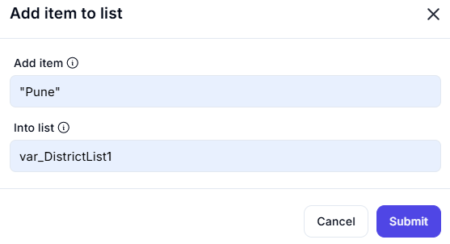

# Increase Variable

This operation increments the value of a specified variable by a given amount. It is useful for counting, tracking progress, or managing numerical values dynamically.  

## **Input**

- **Variable name**: The name of the variable whose value will be increased.  
  - Example: `counter`  

- **Increase by**: The amount by which the variable's value should be increased.  
  - Example: `1`  

### **Output**

- The value of the variable (`counter`) will be increased by the specified amount (`1`).  
- If `counter` was `5`, it will now be `6`.  
