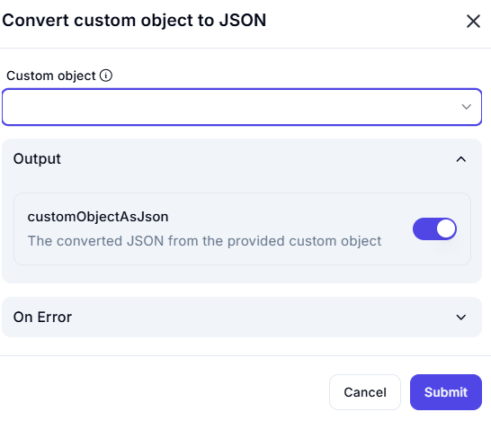

# Convert Custom Object to JSON



## Overview:
In software applications, data is often structured as **custom objects**, which are user-defined entities consisting of multiple attributes. Converting these objects into **JSON (JavaScript Object Notation)** makes data storage, transfer, and interoperability easier between different systems and programming languages.

---

## What is a Custom Object?
A **custom object** is a structured data entity that contains multiple properties and values, much like a real-world object. It is commonly used in programming to represent **complex data structures**.

### **Example of a Custom Object (Python Representation)**
```python
class Employee:
    def __init__(self, emp_id, name, department, skills):
        self.emp_id = emp_id
        self.name = name
        self.department = department
        self.skills = skills

employee_obj = Employee(101, "Alice Johnson", "HR", ["Communication", "Recruitment", "Payroll"])
```
In this example, `Employee` is a **custom object** with attributes such as:
- `emp_id` → Unique identifier of the employee.
- `name` → Employee’s name.
- `department` → Department where the employee works.
- `skills` → A list of skills possessed by the employee.

---

## **Input:**
To convert a custom object into JSON, the user needs to **provide or select** an object.

- **Custom Object:** The object must be structured with named attributes and values.
- **Supported Data Types:** 
  - Strings (`"Alice Johnson"`)
  - Numbers (`101`)
  - Lists (`["Communication", "Recruitment", "Payroll"]`)
  - Nested objects (other objects within an object)

If the object is improperly structured or contains **unsupported types** (e.g., functions or complex objects), the conversion may fail.

---

## **Output:**
Once processed, the tool **serializes** the custom object into JSON format, preserving its structure.

- **Output Variable:** `customObjectAsJson`
- **Output Type:** String (JSON formatted)
- **Usage:** This JSON data can be used for:
  - **API communication**
  - **Database storage**
  - **Configuration files**
  - **Data exchange between applications**

### **Example JSON Output**
```json
{
    "emp_id": 101,
    "name": "Alice Johnson",
    "department": "HR",
    "skills": [
        "Communication",
        "Recruitment",
        "Payroll"
    ]
}
```
- The custom object is now converted into a **readable and structured JSON format**.
- The structure remains the same, ensuring data **integrity**.

---

## **Why Convert Custom Objects to JSON?**
- **Platform Independence:** JSON works across multiple languages and frameworks.
- **Data Storage & Transfer:** JSON can be stored in databases or transferred via APIs.
- **Readability & Maintainability:** JSON is easy to understand, modify, and debug.
- **Compact & Efficient:** Compared to XML, JSON uses less space and is faster to process.

---

## **Conclusion:**
Custom objects are widely used in programming to structure data. Converting them to **JSON** enhances **data portability, interoperability, and efficiency**. This conversion ensures that structured data can be used across different applications seamlessly.
