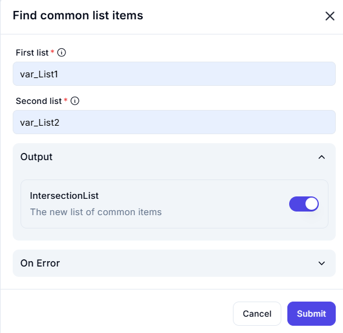

# Find Common List Items  

The **Find Common List Items** feature identifies and extracts the elements that are present in both lists.  

---  

## Configuration Options  

- **First List** (Required)  
  - Specifies the first list to compare.  

- **Second List** (Required)  
  - Specifies the second list to compare.  

- **Output**  
  - **IntersectionList**: The resulting list containing only the common elements from both lists.  

---  

## Input & Output Example  

| **First List (var_List1)** | **Second List (var_List2)** | **IntersectionList (Common Items)** |
|----------------------------|----------------------------|----------------------------------|
| `[1, 2, 3, 4]`             | `[3, 4, 5, 6]`             | `[3, 4]`                        |
| `['A', 'B', 'C']`          | `['B', 'C', 'D']`         | `['B', 'C']`                    |
| `[10, 20, 30]`             | `[40, 50, 60]`            | `[]` (No common elements)       |

---  

This feature is useful for **finding shared elements** between two lists, such as common users, overlapping datasets, or matching entries. 🔍  
