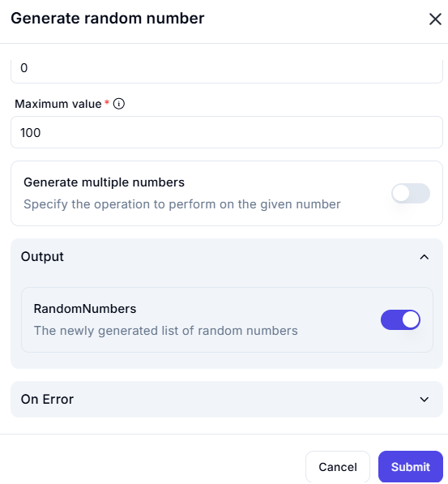

# Generate Random Number  

The **Generate Random Number** feature allows users to generate a random numerical value within a specified range.  

---  

## Configuration Options  

- **Minimum Value** (Optional)  
  - Specifies the lowest possible number in the generated range. Defaults to `0` if left blank.  

- **Maximum Value** (Required)  
  - Defines the highest possible number that can be generated.  

- **Generate Multiple Numbers** (Optional)  
  - If enabled, multiple random numbers will be generated instead of a single value.  

---  

## Input & Output Examples  

| **Minimum Value** | **Maximum Value** | **Generate Multiple Numbers** | **Output (Randomly Generated Number(s))** |
|------------------|------------------|------------------------------|----------------------------------|
| `0`             | `100`            | No                           | `42`                             |
| `10`            | `50`             | No                           | `27`                             |
| `1`             | `5`              | No                           | `3`                              |
| `0`             | `100`            | Yes                          | `[23, 87, 45]`                   |
| `5`             | `10`             | Yes                          | `[6, 9, 8]`                      |

---  

This feature is useful for **random sampling**, **simulations**, **testing scenarios**, and **statistical analysis** where randomly generated values are required.  
