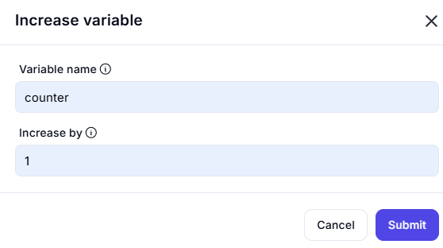

# Increase Variable

## Description

This operation is used to increment the value of a specified variable by a given amount. It is useful in scenarios where counters or iterative operations are required.

## Input

- **Variable Name**: The name of the variable to be increased.  
  - Example: `counter`
  
- **Increase By**: The numeric value by which the variable should be incremented.  
  - Example: `1`

## Output

- The specified variable (`counter`) will be updated with its new value after being increased by the given amount.
