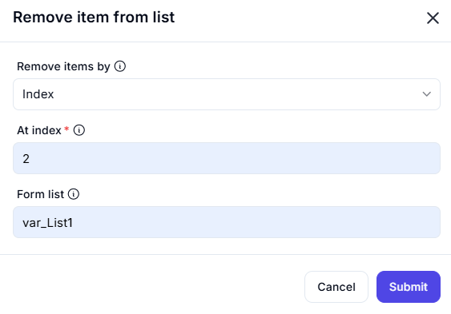

# Remove Item from List  

The **Remove Item from List** feature enables users to remove a specific element from a list based on the selected criteria.  

---  

## Configuration Options  

- **Remove Items By** (Required)  
  - Defines the method for removing an item from the list. Options include:
    - **Index**: Removes an item at the specified position.  
    - **Value**: Removes an item matching a given value.  

- **At Index** (Required if removing by Index)  
  - Specifies the position of the item to be removed, using a zero-based index.  

- **Form List** (Required)  
  - Specifies the list from which the item will be removed.  

---  

## Input & Output Example  

| **Input List**       | **Remove Items By** | **Value/Index** | **Output List**     |
|----------------------|--------------------|----------------|---------------------|
| `[10, 20, 30, 40]`  | Index              | `2`            | `[10, 20, 40]`     |
| `['A', 'B', 'C']`   | Value              | `'B'`          | `['A', 'C']`       |
| `[True, False, True]` | Index            | `0`            | `[False, True]`    |

---  

This feature is particularly useful for **list modifications**, **removing unwanted elements**, and **dynamic list management**.  
