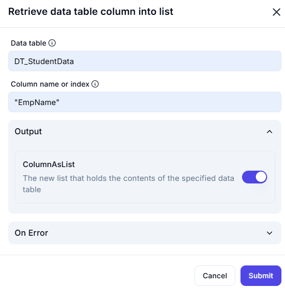

# Retrieve Data Table Column into List  

The **Retrieve Data Table Column into List** feature extracts a specific column from a data table and converts it into a list.  

---  

## Configuration Options  

- **Data Table** (Required)  
  - Specifies the source data table from which the column will be extracted.  

- **Column Name or Index** (Required)  
  - The column name (e.g., `"EmpName"`) or index (e.g., `0` for the first column) that should be converted into a list.  

- **Output**  
  - **ColumnAsList**: The generated list containing all values from the specified column.  

---  

## Input & Output Example  

### Given Data Table (`DT_StudentData`)

| StudentID | EmpName   | Age | Department  |
|-----------|----------|-----|------------|
| 101       | Alice    | 25  | HR         |
| 102       | Bob      | 30  | IT         |
| 103       | Charlie  | 28  | Finance    |

### If Column `"EmpName"` is extracted:

| **Column Name** | **Resulting List** |
|----------------|----------------|
| `"EmpName"`    | `["Alice", "Bob", "Charlie"]` |

---  

This feature is useful for **extracting specific attributes** from structured data tables for further processing. 🚀  
