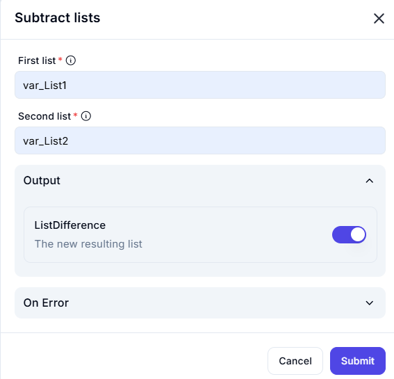

# Subtract Lists  

The **Subtract Lists** feature removes elements in the second list from the first list and returns the difference.  

---  

## Configuration Options  

- **First List** (Required)  
  - Specifies the base list from which elements will be removed.  

- **Second List** (Required)  
  - Specifies the list containing elements to be subtracted from the first list.  

- **Output**  
  - **ListDifference**: The resulting list after removing elements of the second list from the first list.  

---  

## Input & Output Example  

| **First List (var_List1)** | **Second List (var_List2)** | **ListDifference (Result)** |
|----------------------------|----------------------------|------------------------------|
| `[1, 2, 3, 4, 5]`         | `[3, 4]`                   | `[1, 2, 5]`                  |
| `['A', 'B', 'C', 'D']`    | `['B', 'D']`               | `['A', 'C']`                 |
| `[10, 20, 30, 40]`        | `[50, 60]`                 | `[10, 20, 30, 40]` (No change) |

---  

This feature is useful for **removing unwanted elements** from a dataset, filtering unique values, or performing set operations. ✨  
