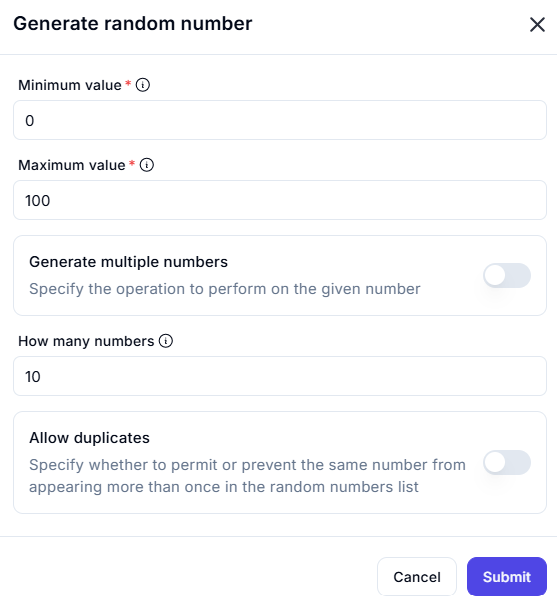

# Generate Random Number

The **Generate Random Number** feature allows users to generate random numbers within a specified range. Users can configure various settings to customize the number generation process.

## Configuration Options

| **Option**                 | **Description** |
|----------------------------|----------------|
| **Minimum Value** (Required) | Specifies the lowest possible number that can be generated. Example: `0` |
| **Maximum Value** (Required) | Specifies the highest possible number that can be generated. Example: `100` |
| **Generate Multiple Numbers** | Toggle this option to generate multiple numbers instead of a single number. |
| **How Many Numbers** | Specifies the number of random numbers to generate (if multiple numbers are enabled). Example: `10` |
| **Allow Duplicates** | Determines whether duplicate numbers are allowed in the generated list. If disabled, all generated numbers will be unique. |

## Actions

| **Action**  | **Description** |
|------------|----------------|
| **Submit**  | Generates the random number(s) based on the provided configuration. |
| **Cancel**  | Closes the random number generator without generating numbers. |

This feature is useful for scenarios such as simulations, statistical sampling, gaming applications, and randomized selections.
