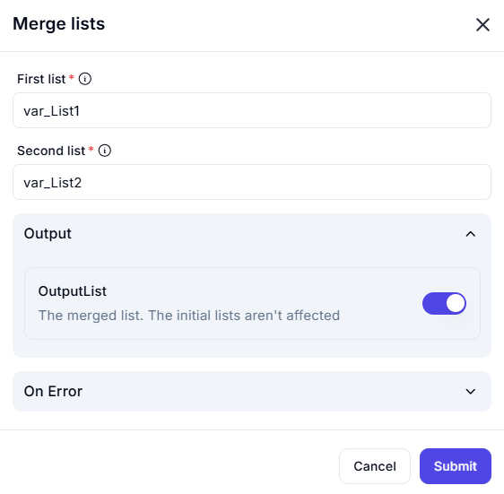

# Merge Lists

The **Merge Lists** feature allows users to combine two lists into a single merged list. The original lists remain unchanged, and the merged output is stored separately.

## Configuration Options

| **Option**         | **Description** |
|--------------------|----------------|
| **First List** (Required) | Specifies the first list to be merged. Example: `var_List1` |
| **Second List** (Required) | Specifies the second list to be merged. Example: `var_List2` |
| **Output** (Optional) | Determines where the merged list will be stored. If enabled, the merged list will be saved in **OutputList**, while the original lists remain unaffected. |
| **On Error** (Optional) | Defines error handling behavior in case of any issues during the merge process. |

## Actions

| **Action**  | **Description** |
|------------|----------------|
| **Submit**  | Merges the two specified lists and stores the result. |
| **Cancel**  | Closes the dialog without making any changes. |

This feature is useful for data aggregation, automation workflows, and list management operations where combining lists is necessary.
