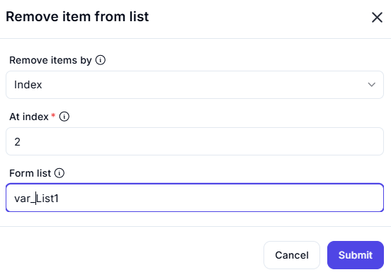

# Remove Duplicate Items from List

The **Remove Duplicate Items from List** feature allows users to remove duplicate elements from a specified list.

## Configuration Options

| **Option**  | **Description** |
|------------|----------------|
| **List to Remove Duplicate Items From** (Required) | Specifies the list from which duplicate elements should be removed. |
| **Ignore Text Case While Searching for Duplicates** (Required) | Determines whether the search for duplicates should be case-sensitive (`No`) or case-insensitive (`Yes`). |

## Actions

| **Action**  | **Description** |
|------------|----------------|
| **Submit**  | Removes duplicate items based on the provided input settings. |
| **Cancel**  | Closes the remove duplicate items operation without making changes. |

## Input & Output Examples

| **Input List**  | **Ignore Text Case** | **Output (Duplicates Removed)** |
|----------------|----------------------|---------------------------------|
| `[1, 2, 2, 3, 4, 4, 5]`  | No  | `[1, 2, 3, 4, 5]` |
| `['A', 'B', 'a', 'C', 'b']`  | No  | `['A', 'B', 'a', 'C', 'b']` |
| `['A', 'B', 'a', 'C', 'b']`  | Yes | `['A', 'B', 'C']` |
| `[True, False, True]`  | No  | `[True, False]` |

This feature is useful for data cleaning, duplicate removal, and improving list integrity.
