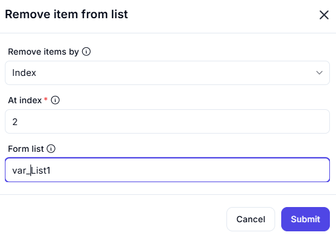

# Remove Item from List

The **Remove Item from List** feature allows users to delete a specific item from a list based on the selected criteria. This functionality is useful for managing list data dynamically.

## Configuration Options

### 1. **Remove Items By** (Dropdown)
   - Specifies the method to identify the item to be removed.
   - Options: `Index` (removes an item by its position in the list).

### 2. **At Index** (Required)
   - Defines the index position of the item to be removed.
   - Example: `2` (removes the item at index 2).

### 3. **From List** (Required)
   - Specifies the name of the list from which the item will be removed.
   - Example: `var_list1`

## Actions

- **Submit**: Removes the specified item from the list.
- **Cancel**: Closes the dialog without making any changes.

This feature is useful in list management, automation, and data processing tasks where dynamic modifications are required.
