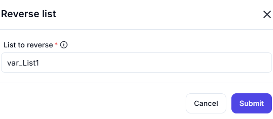

# Reverse List

The **Reverse List** feature allows users to reverse the order of elements in a specified list.

## Configuration Options

| **Option**          | **Description** |
|---------------------|----------------|
| **List to Reverse** (Required) | Specifies the list whose elements should be reversed. |

## Actions

| **Action**  | **Description** |
|------------|----------------|
| **Submit**  | Reverses the list based on the provided input. |
| **Cancel**  | Closes the reverse list operation without making changes. |

## Input & Output Examples

| **Input List**  | **Output (Reversed List)** |
|----------------|----------------------------|
| `[1, 2, 3, 4, 5]`  | `[5, 4, 3, 2, 1]` |
| `['A', 'B', 'C']`  | `['C', 'B', 'A']` |
| `[True, False, True]` | `[True, False, True]` |

This feature is useful for data manipulation, ordering corrections, and list transformations.
