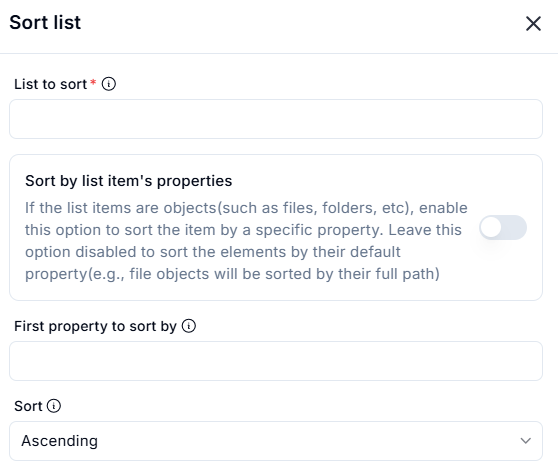

# Sort List

The **Sort List** feature allows users to sort a list based on default values or specific properties if the list items are objects. This is useful for organizing data efficiently.

## Configuration Options

### 1. **List to Sort** (Required)
   - Specifies the list that needs to be sorted.

### 2. **Sort by List Item's Properties** (Optional)
   - If the list contains objects (such as files, folders, etc.), enabling this option allows sorting based on a specific property.
   - If disabled, the list is sorted by the default property (e.g., file objects will be sorted by their full path).

### 3. **First Property to Sort By** (Optional)
   - Defines the property of the list items to be used for sorting.
   - Example: Sorting files by `name`, `size`, or `date modified`.

### 4. **Sort Order**
   - Specifies the order in which the list should be sorted.
   - Options:
     - `Ascending` (default)
     - `Descending`

## Actions

- **Submit**: Sorts the list based on the specified criteria.
- **Cancel**: Closes the dialog without making any changes.

This feature is useful for managing structured lists, file directories, or datasets that require sorting based on different attributes.
